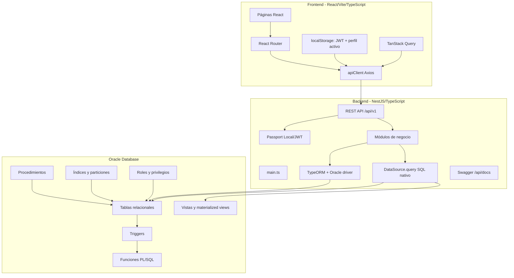
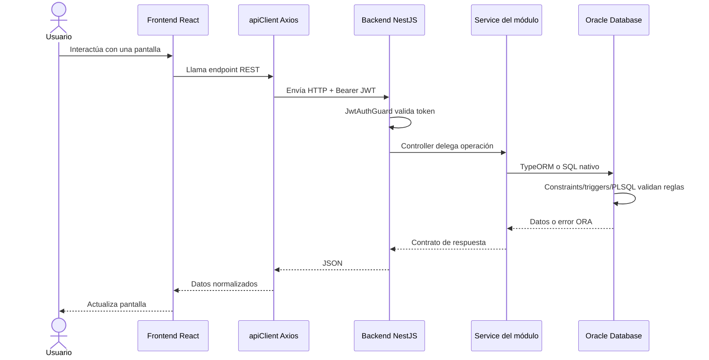
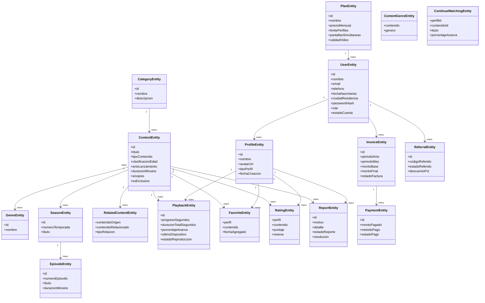
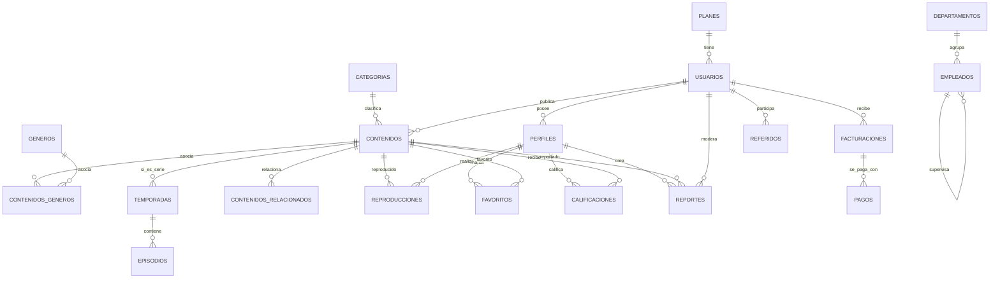
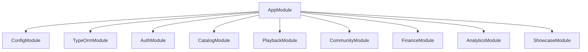
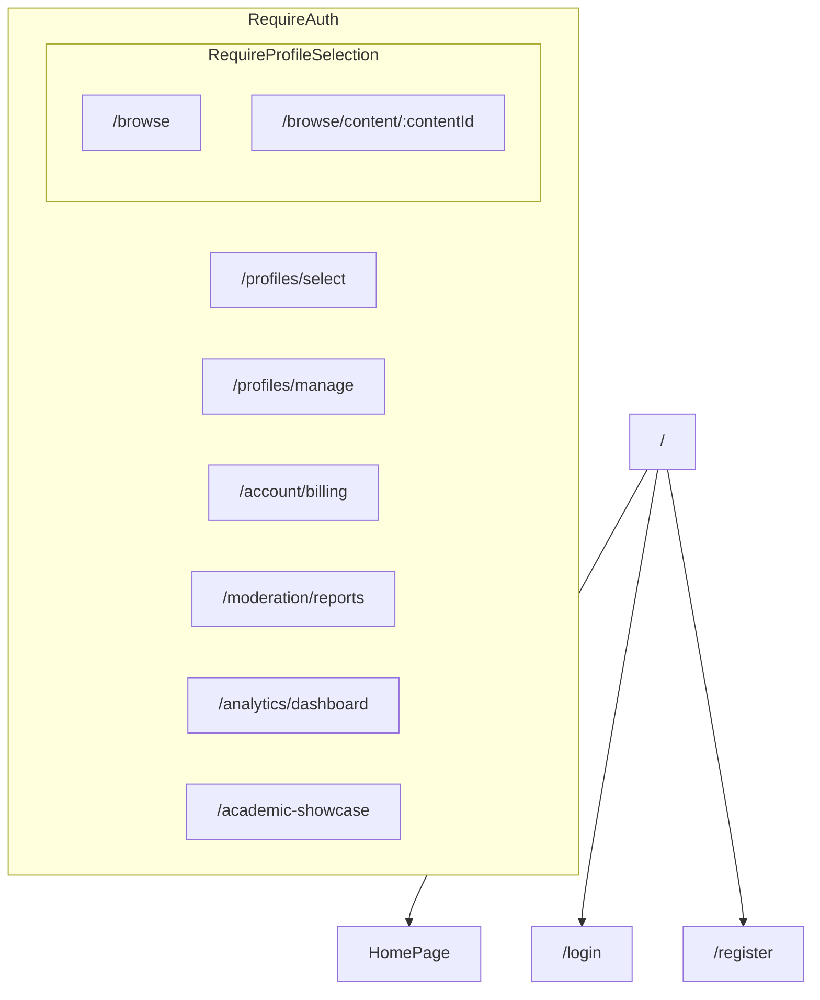
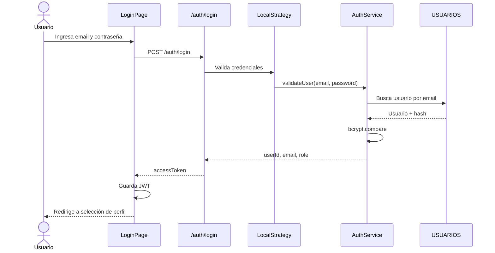
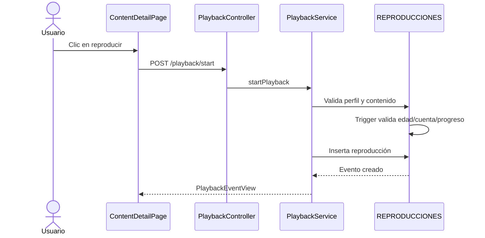
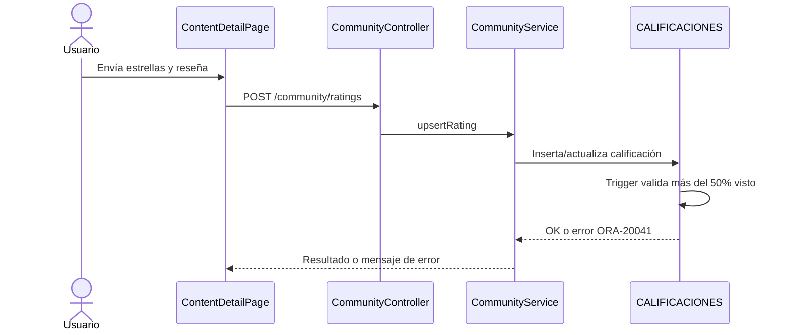
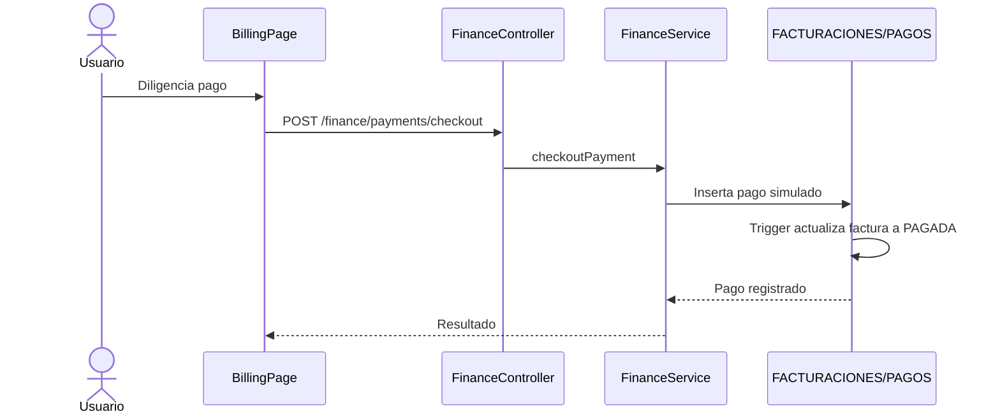

# MinFlix - Resumen Integral del Proyecto para Sustentación

> **Proyecto académico:** Bases de Datos II - Noveno Semestre  
> **Autores:** Juan Sebastián Noreña Espinosa, Daniel Eduardo Jurado Celemín, Samuel Andrés Castaño  
> **Stack principal:** Oracle Database + NestJS + React/Vite + TypeScript  
> **Objetivo:** explicar arquitectura, UML, clases, módulos, consultas SQL, scripts Oracle y flujos principales para sustentar el proyecto ante la profesora.

---

## Tabla de contenido

1. [Resumen ejecutivo](#1-resumen-ejecutivo)
2. [Arquitectura general](#2-arquitectura-general)
3. [UML y modelo del dominio](#3-uml-y-modelo-del-dominio)
4. [Base de datos Oracle](#4-base-de-datos-oracle)
5. [Backend NestJS](#5-backend-nestjs)
6. [Frontend React/Vite](#6-frontend-reactvite)
7. [Consultas SQL por clase](#7-consultas-sql-por-clase)
8. [Flujos principales](#8-flujos-principales)
9. [Seguridad y reglas de negocio](#9-seguridad-y-reglas-de-negocio)
10. [Núcleos académicos NT1..NT4](#10-núcleos-académicos-nt1nt4)
11. [Guía de sustentación](#11-guía-de-sustentación)
12. [Preguntas probables](#12-preguntas-probables)
13. [Mapa de archivos importantes](#13-mapa-de-archivos-importantes)

---

## 1. Resumen ejecutivo

MinFlix es una plataforma de streaming multimedia inspirada en servicios como Netflix. Permite registrar usuarios, iniciar sesión, seleccionar perfiles, navegar un catálogo de contenidos, reproducir, continuar viendo, guardar favoritos, calificar, reportar contenido, moderar reportes, consultar facturas, simular pagos y visualizar analítica ejecutiva.

La característica más importante del proyecto es que Oracle no se usa solo como almacenamiento. Oracle también aplica reglas de negocio, seguridad, analítica y optimización mediante constraints, triggers, funciones, procedimientos, vistas, vistas materializadas, roles, privilegios, particiones e índices.

| Área | Qué demuestra |
|---|---|
| **Frontend** | Experiencia de usuario tipo streaming, formularios, rutas protegidas, dashboards y showcase académico. |
| **Backend** | API REST modular con NestJS, autenticación JWT, DTOs, servicios, controladores, TypeORM y SQL nativo. |
| **Oracle** | Modelo relacional, integridad, reglas de negocio, PL/SQL, transacciones, roles, analítica e indexación. |

### Idea central para explicar

MinFlix es un sistema de tres capas donde React muestra la interfaz, NestJS coordina la API y Oracle garantiza integridad, reglas de negocio y análisis avanzado. La base de datos es parte activa del sistema, no un repositorio pasivo.

---

## 2. Arquitectura general

### 2.1 Diagrama de tres capas



### 2.2 Responsabilidades por capa

| Capa | Tecnología | Responsabilidad |
|---|---|---|
| **Frontend** | React, Vite, TypeScript, React Router, Axios, TanStack Query | UI, navegación, formularios, sesión local, consumo de API y visualización. |
| **Backend** | NestJS, TypeScript, TypeORM, Passport, JWT, Swagger | API REST, autenticación, autorización, DTOs, servicios, validación y conexión a Oracle. |
| **Base de datos** | Oracle SQL/PLSQL | Persistencia, reglas de negocio, triggers, funciones, vistas, roles, transacciones e índices. |

### 2.3 Flujo general de una petición



### 2.4 Configuración relevante

| Variable | Uso |
|---|---|
| `DB_CONNECT_STRING` | Cadena de conexión Oracle. |
| `DB_USER` | Usuario de aplicación, por ejemplo `MINFLIX_APP`. |
| `DB_PASSWORD` | Contraseña de Oracle. |
| `DB_SCHEMA` | Esquema usado por TypeORM. |
| `JWT_SECRET` | Firma de tokens JWT. |
| `CORS_ORIGIN` | Origen permitido del frontend. |
| `VITE_API_URL` | URL base del backend consumida desde React. |

---

## 3. UML y modelo del dominio

### 3.1 UML de clases principales



### 3.2 Modelo entidad-relación principal



### 3.3 Paquetes funcionales del dominio

| Paquete | Entidades principales | Qué representa |
|---|---|---|
| **Cuentas** | `USUARIOS`, `PLANES`, `PERFILES` | Registro, autenticación, planes y perfiles. |
| **Catálogo** | `CATEGORIAS`, `CONTENIDOS`, `GENEROS`, `TEMPORADAS`, `EPISODIOS` | Contenido multimedia navegable. |
| **Reproducción** | `REPRODUCCIONES`, `VW_CONTINUAR_VIENDO` | Tracking de consumo, progreso e historial. |
| **Comunidad** | `FAVORITOS`, `CALIFICACIONES`, `REPORTES` | Interacción de perfiles con contenidos. |
| **Finanzas** | `FACTURACIONES`, `PAGOS`, `REFERIDOS` | Cobros, pagos simulados y descuentos. |
| **Analítica** | `VW_ANALITICA_CONSUMO`, `VW_ANALITICA_FINANZAS`, `VW_ANALITICA_RENDIMIENTO` | Reportes ejecutivos. |
| **Organización** | `DEPARTAMENTOS`, `EMPLEADOS` | Estructura interna para analítica. |

---

## 4. Base de datos Oracle

### 4.1 Enfoque: Fat Database

MinFlix usa Oracle como una base de datos robusta. La base no solo guarda datos: también protege el modelo. Si otro cliente intentara insertar información sin pasar por el backend, Oracle seguiría aplicando reglas mediante constraints, triggers, funciones y privilegios.

Esto demuestra conceptos centrales de Bases de Datos II: modelado relacional, integridad, PL/SQL, transacciones, seguridad, vistas, particiones, índices y analítica.

### 4.2 Scripts versionados

| Script | Archivo | Propósito |
|---|---|---|
| `00` | `00_drop_all.sql` | Limpieza del esquema para reiniciar despliegues. |
| `01` | `01_bootstrap_oracle_iteracion1.sql` | Crea `PLANES`, `USUARIOS`, `PERFILES`. |
| `02` | `02_catalogo_base_iteracion2.sql` | Crea `CATEGORIAS` y `CONTENIDOS`. |
| `03` | `03_reglas_perfiles_iteracion1.sql` | Reglas de perfiles y clasificación. |
| `04` | `04_reproducciones_iteracion2.sql` | Crea `REPRODUCCIONES` y `VW_CONTINUAR_VIENDO`. |
| `05` | `05_comunidad_favoritos_iteracion3.sql` | Crea favoritos y reglas. |
| `06` | `06_comunidad_calificaciones_iteracion3.sql` | Crea calificaciones y regla del 50%. |
| `07` | `07_catalogo_extendido_iteracion4.sql` | Géneros, temporadas, episodios y relacionados. |
| `08` | `08_comunidad_reportes_moderacion_iteracion4.sql` | Reportes y moderación. |
| `09` | `09_finanzas_referidos_iteracion5.sql` | Referidos, facturas, pagos y mora. |
| `10` | `10_organizacion_equipo_iteracion5.sql` | Departamentos y empleados. |
| `11` | `11_seguridad_roles_nt5.sql` | Roles, usuarios DB, profile y grants. |
| `12` | `12_diccionario_comentarios_modelo_fisico.sql` | Comentarios del modelo físico. |
| `13` | `13_seed_usuarios_roles_login_iteracion5.sql` | Usuarios semilla por rol. |
| `14` | `14_seed_datos_funcionales_iteracion5.sql` | Dataset funcional amplio. |
| `15` | `15_finanzas_vistas_api_iteracion6.sql` | Vistas de apoyo para finanzas. |
| `16` | `16_usuarios_datos_personales_iteracion6.sql` | Datos personales para segmentación. |
| `17` | `17_analitica_nt1.sql` | NT1: particiones, MVs, PIVOT, ROLLUP, CUBE, vistas analíticas. |
| `18` | `18_plsql_nt2_completo.sql` | NT2: funciones, procedimientos, cursores y errores. |
| `19` | `19_transacciones_nt3.sql` | NT3: transacciones, savepoints, locks y rollback. |
| `20` | `20_indices_nt4.sql` | NT4: índices y `EXPLAIN PLAN`. |
| `21` | `21_validacion_cierre.sql` | Validación final del esquema. |
| `22` | `22_roles_favoritos_iteracion7.sql` | Refactor de roles/favoritos. |
| Maestro | `run_all.sql` | Ejecución ordenada del esquema. |

### 4.3 Tablas por área

| Área | Tablas | Descripción |
|---|---|---|
| **Usuarios** | `PLANES`, `USUARIOS`, `PERFILES` | Cuentas, datos personales, plan y perfiles. |
| **Catálogo** | `CATEGORIAS`, `CONTENIDOS`, `GENEROS`, `CONTENIDOS_GENEROS`, `TEMPORADAS`, `EPISODIOS`, `CONTENIDOS_RELACIONADOS` | Estructura del contenido. |
| **Reproducción** | `REPRODUCCIONES` | Eventos de consumo. |
| **Comunidad** | `FAVORITOS`, `CALIFICACIONES`, `REPORTES` | Lista, ratings y moderación. |
| **Finanzas** | `FACTURACIONES`, `PAGOS`, `REFERIDOS` | Facturación, pagos y descuentos. |
| **Organización** | `DEPARTAMENTOS`, `EMPLEADOS` | Equipo interno para analítica. |

### 4.4 Vistas y vistas materializadas

| Objeto | Tipo | Uso |
|---|---|---|
| `VW_CONTINUAR_VIENDO` | Vista | Contenidos no finalizados por perfil. |
| `VW_CONTENIDO_VISIBLE_POR_PERFIL` | Vista | Apoyo a visibilidad por clasificación. |
| `VW_REPORTES_PENDIENTES_SOPORTE` | Vista | Bandeja de reportes pendientes. |
| `VW_ANALITICA_CONSUMO` | Vista | Consumo por ciudad, categoría, género, dispositivo, plan y mes. |
| `VW_ANALITICA_FINANZAS` | Vista | Ingresos, facturas, cobrados y pendientes. |
| `VW_ANALITICA_RENDIMIENTO` | Vista | Métricas de empleados por departamento. |
| `MV_CALIFICACIONES_PROMEDIO` | Vista materializada | Promedios de calificación por contenido. |
| `MV_METRICAS_FINANCIERAS` | Vista materializada | Métricas financieras precalculadas. |

### 4.5 Triggers principales

| Trigger o grupo | Tabla | Regla |
|---|---|---|
| `TRG_PERFILES_LIMITE_PLAN_BI` | `PERFILES` | Impide superar el límite de perfiles del plan. |
| `TRG_REPRODUCCIONES_REGLAS_BIU` | `REPRODUCCIONES` | Valida cuenta, edad, progreso y calcula porcentaje. |
| `TRG_FAVORITOS_REGLAS_BI` | `FAVORITOS` | Bloquea favoritos no permitidos para perfiles infantiles. |
| Trigger de calificaciones | `CALIFICACIONES` | Permite calificar solo si se vio más del 50%. |
| Triggers de reportes | `REPORTES` | Controlan estados y moderación. |
| `TRG_FACTURACIONES_CALCULO_BIU` | `FACTURACIONES` | Calcula monto final y valida periodos. |
| `TRG_PAGOS_ACTUALIZA_FACTURA_AI` | `PAGOS` | Pago exitoso actualiza factura y estado de cuenta. |

### 4.6 Funciones y procedimientos

| Objeto | Propósito |
|---|---|
| `FN_CLASIFICACION_PERMITIDA_PARA_PERFIL` | Determina si un perfil puede ver una clasificación. |
| `FN_CALCULAR_MONTO` | Calcula factura con descuentos por referidos y fidelidad. |
| `FN_CONTENIDO_RECOMENDADO` | Recomienda contenido según favoritos/historial. |
| `SP_APLICAR_MORA_CUENTAS` | Aplica mora a cuentas con facturas vencidas. |

### 4.7 Índices y optimización

| Índice | Tabla | Justificación |
|---|---|---|
| `IDX_REPRODUCCIONES_PERFIL_FECHA_INICIO` | `REPRODUCCIONES` | Historial por perfil ordenado por fecha. |
| `IDX_CONTENIDOS_CATEGORIA_ANIO` | `CONTENIDOS` | Filtros de catálogo. |
| `IDX_USUARIOS_CIUDAD_ESTADO` | `USUARIOS` | Segmentación por ciudad y estado. |
| `IDX_CALIFICACIONES_CONTENIDO_FECHA` | `CALIFICACIONES` | Agregaciones por contenido y fecha. |
| `IDX_REPRODUCCIONES_PERFIL_EVENTO` | `REPRODUCCIONES` | Último evento por perfil. |
| `IDX_REPRODUCCIONES_CONTENIDO` | `REPRODUCCIONES` | Analítica por contenido. |
| `IDX_REPRODUCCIONES_ESTADO` | `REPRODUCCIONES` | Filtros por estado. |

---

## 5. Backend NestJS

### 5.1 Estructura general

```text
minflix-backend/src/
├── main.ts
├── app.module.ts
├── config/database.config.ts
├── auth/
├── catalog/
├── playback/
├── community/
├── finance/
├── analytics/
└── showcase/
```

`main.ts` configura CORS, Helmet, compresión, Swagger, prefijo `/api/v1` y `ValidationPipe`. `app.module.ts` integra `AuthModule`, `CatalogModule`, `PlaybackModule`, `CommunityModule`, `FinanceModule`, `AnalyticsModule` y `ShowcaseModule`.



### 5.2 Módulos backend

| Módulo | Controller | Service | Responsabilidad |
|---|---|---|---|
| `AuthModule` | `AuthController` | `AuthService` | Registro, login, JWT, perfiles y avatar. |
| `CatalogModule` | `CatalogController` | `CatalogService` | Categorías, contenidos, géneros, temporadas, episodios y relacionados. |
| `PlaybackModule` | `PlaybackController` | `PlaybackService` | Inicio, progreso, historial y continuar viendo. |
| `CommunityModule` | `CommunityController` | `CommunityService` | Favoritos, calificaciones, reportes y moderación. |
| `FinanceModule` | `FinanceController` | `FinanceService` | Facturas, pagos simulados, referidos y resumen financiero. |
| `AnalyticsModule` | `AnalyticsController` | `AnalyticsService` | Dashboards ejecutivos con vistas analíticas. |
| `ShowcaseModule` | `ShowcaseController` | `ShowcaseService` | Demostración académica NT1..NT4 con SQL nativo. |

### 5.3 `AuthModule`

| Elemento | Detalle |
|---|---|
| **Entidades** | `UserEntity`, `PlanEntity`, `ProfileEntity`. |
| **Seguridad** | `LocalStrategy`, `JwtStrategy`, `LocalAuthGuard`, `JwtAuthGuard`. |
| **Función principal** | Autenticación, registro y perfiles. |

| Método | Ruta | Seguridad | Descripción |
|---|---|---|---|
| `POST` | `/auth/login` | LocalAuth | Login con email/contraseña y generación de JWT. |
| `POST` | `/auth/register` | Público | Registro de usuario y perfil inicial. |
| `GET` | `/auth/profile` | JWT | Identidad autenticada. |
| `GET` | `/auth/profiles` | JWT | Lista perfiles. |
| `POST` | `/auth/profiles` | JWT | Crea perfil validando límite de plan. |
| `POST` | `/auth/profiles/avatar` | JWT + multipart | Sube avatar. |
| `PATCH` | `/auth/profiles/:profileId` | JWT | Actualiza perfil. |
| `DELETE` | `/auth/profiles/:profileId` | JWT | Elimina perfil. |

### 5.4 `CatalogModule`

| Entidad | Tabla |
|---|---|
| `CategoryEntity` | `CATEGORIAS` |
| `ContentEntity` | `CONTENIDOS` |
| `GenreEntity` | `GENEROS` |
| `ContentGenreEntity` | `CONTENIDOS_GENEROS` |
| `SeasonEntity` | `TEMPORADAS` |
| `EpisodeEntity` | `EPISODIOS` |
| `RelatedContentEntity` | `CONTENIDOS_RELACIONADOS` |

| Método | Ruta | Seguridad | Descripción |
|---|---|---|---|
| `GET` | `/catalog/categories` | Público | Lista categorías. |
| `POST` | `/catalog/categories` | JWT + `admin/contenido` | Crea categoría. |
| `GET` | `/catalog/contents` | Público | Lista contenidos con filtros. |
| `GET` | `/catalog/contents/:contentId` | Público | Detalle de contenido. |
| `POST` | `/catalog/contents` | JWT + `admin/contenido` | Crea contenido. |
| `PATCH` | `/catalog/contents/:contentId` | JWT + `admin/contenido` | Actualiza contenido. |
| `GET` | `/catalog/genres` | Público | Lista géneros. |
| `GET` | `/catalog/contents/:contentId/genres` | Público | Géneros por contenido. |
| `GET` | `/catalog/contents/:contentId/seasons` | Público | Temporadas. |
| `GET` | `/catalog/seasons/:seasonId/episodes` | Público | Episodios. |
| `GET` | `/catalog/contents/:contentId/related` | Público | Relacionados. |

### 5.5 `PlaybackModule`

| Entidad | Tabla/Vista | Descripción |
|---|---|---|
| `PlaybackEntity` | `REPRODUCCIONES` | Eventos de reproducción. |
| `ContinueWatchingEntity` | `VW_CONTINUAR_VIENDO` | Vista para seguir viendo. |

| Método | Ruta | Seguridad | Descripción |
|---|---|---|---|
| `POST` | `/playback/start` | JWT | Inicia reproducción. |
| `POST` | `/playback/progress` | JWT | Reporta avance, pausa o finalización. |
| `GET` | `/playback/continue-watching` | JWT | Lista contenidos no finalizados. |
| `GET` | `/playback/history` | JWT | Historial de reproducción. |

### 5.6 `CommunityModule`

| Entidad | Tabla | Descripción |
|---|---|---|
| `FavoriteEntity` | `FAVORITOS` | Lista de favoritos por perfil. |
| `RatingEntity` | `CALIFICACIONES` | Puntaje y reseña. |
| `ReportEntity` | `REPORTES` | Reportes y moderación. |

| Grupo | Método | Ruta | Descripción |
|---|---|---|---|
| Favoritos | `POST` | `/community/favorites` | Agregar favorito. |
| Favoritos | `DELETE` | `/community/favorites/:contenidoId` | Quitar favorito. |
| Favoritos | `GET` | `/community/favorites` | Listar favoritos. |
| Favoritos | `GET` | `/community/favorites/status` | Estado de favorito. |
| Calificaciones | `POST` | `/community/ratings` | Crear/actualizar rating. |
| Calificaciones | `DELETE` | `/community/ratings/:contenidoId` | Eliminar rating. |
| Calificaciones | `GET` | `/community/ratings` | Listar ratings. |
| Calificaciones | `GET` | `/community/ratings/status` | Estado de rating. |
| Reportes | `POST` | `/community/reports` | Crear reporte. |
| Reportes | `GET` | `/community/reports` | Reportes propios. |
| Moderación | `GET` | `/community/reports/moderation` | Bandeja de moderación. |
| Moderación | `PATCH` | `/community/reports/:reporteId/moderation` | Moderar reporte. |

### 5.7 `FinanceModule`

| Entidad | Tabla | Descripción |
|---|---|---|
| `InvoiceEntity` | `FACTURACIONES` | Facturas. |
| `PaymentEntity` | `PAGOS` | Pagos. |
| `ReferralEntity` | `REFERIDOS` | Referidos y descuentos. |

| Método | Ruta | Seguridad | Descripción |
|---|---|---|---|
| `GET` | `/finance/summary` | JWT | Resumen financiero. |
| `GET` | `/finance/invoices` | JWT | Facturas. |
| `GET` | `/finance/payments` | JWT | Pagos. |
| `GET` | `/finance/referrals` | JWT | Referidos. |
| `POST` | `/finance/payments/checkout` | JWT | Pago simulado. |

### 5.8 `AnalyticsModule`

| Método | Ruta | Vista Oracle | Descripción |
|---|---|---|---|
| `GET` | `/analytics/consumption` | `VW_ANALITICA_CONSUMO` | Consumo por dimensiones. |
| `GET` | `/analytics/finance` | `VW_ANALITICA_FINANZAS` | Métricas financieras. |
| `GET` | `/analytics/internal-performance` | `VW_ANALITICA_RENDIMIENTO` | Rendimiento interno. |

Solo roles `admin` y `analista` pueden acceder.

### 5.9 `ShowcaseModule`

| Núcleo | Endpoints | Qué demuestra |
|---|---|---|
| NT1 | `/showcase/nt1/partitions`, `/materialized-views`, `/pivot-sample`, `/rollup-sample` | Particiones, MVs, PIVOT, ROLLUP. |
| NT2 | `/showcase/nt2/cartera-vencida`, `/function-monto`, `/function-recommendation`, `/triggers` | Cursores, funciones y triggers. |
| NT3 | `/showcase/nt3/atomic-demo`, `/savepoint-demo`, `/cascade-demo`, `/concurrency-locks`, `/sessions` | Transacciones y concurrencia. |
| NT4 | `/showcase/nt4/indexes`, `/explain-plan-reference` | Índices y plan de ejecución. |

---

## 6. Frontend React/Vite

### 6.1 Estructura general

```text
minflix-frontend/src/
├── main.tsx
├── App.tsx
├── index.css
├── router/
│   ├── AppRouter.tsx
│   ├── RequireAuth.tsx
│   └── RequireProfileSelection.tsx
├── pages/
│   ├── HomePage.tsx
│   ├── LoginPage.tsx
│   ├── RegisterPage.tsx
│   ├── ProfileSelectorPage.tsx
│   ├── ProfilesPage.tsx
│   ├── BrowsePage.tsx
│   ├── ContentDetailPage.tsx
│   ├── BillingPage.tsx
│   ├── ReportsModerationPage.tsx
│   ├── AnalyticsDashboardPage.tsx
│   └── AcademicShowcasePage.tsx
└── shared/
    ├── api/
    ├── helpers/
    ├── session/
    └── ui/
```

### 6.2 Rutas



### 6.3 Páginas principales

| Página | Propósito | Endpoints principales |
|---|---|---|
| `HomePage` | Landing pública. | - |
| `LoginPage` | Inicio de sesión. | `POST /auth/login` |
| `RegisterPage` | Registro con plan y perfil inicial. | `POST /auth/register` |
| `ProfileSelectorPage` | Selección de perfil. | `GET /auth/profiles` |
| `ProfilesPage` | CRUD de perfiles y avatar. | `/auth/profiles`, `/auth/profiles/avatar` |
| `BrowsePage` | Catálogo, continuar viendo, favoritos e historial. | `/catalog/*`, `/playback/*`, `/community/favorites` |
| `ContentDetailPage` | Detalle, reproducción, rating, favoritos, reportes y relacionados. | `/catalog/*`, `/playback/start`, `/community/*` |
| `BillingPage` | Facturación, pagos y referidos. | `/finance/*` |
| `ReportsModerationPage` | Moderación soporte/admin. | `/community/reports/moderation` |
| `AnalyticsDashboardPage` | Dashboards ejecutivos. | `/analytics/*` |
| `AcademicShowcasePage` | Demostración NT1..NT4. | `/showcase/*` |

### 6.4 Estado y utilidades

| Archivo | Uso |
|---|---|
| `shared/api/client.ts` | Axios con `baseURL`, timeout e interceptor JWT. |
| `shared/session/authSession.ts` | Decodifica token y obtiene usuario/rol. |
| `shared/session/profileSession.ts` | Guarda perfil activo. |
| `shared/helpers/avatarUrl.ts` | Resuelve avatars. |
| `shared/helpers/plansCatalog.ts` | Catálogo visual de planes. |
| `shared/ui/buttonStyles.ts` | Estilos reutilizables de botones. |
| `shared/ui/components/DataTable.tsx` | Render de resultados tabulares. |
| `index.css` | Sistema visual con clases `nf-`. |

---

## 7. Consultas SQL por clase

### 7.1 Resumen

| Tipo de acceso | Clases | Descripción |
|---|---|---|
| Repositorios TypeORM | `AuthService`, `CatalogService`, `PlaybackService`, `CommunityService`, `FinanceService` | CRUD y consultas sobre entidades. |
| QueryBuilder | `AuthService`, `CatalogService`, `PlaybackService`, `CommunityService`, `FinanceService` | Filtros, joins y ordenamientos. |
| SQL nativo | `AnalyticsService`, `ShowcaseService` | Consultas directas a vistas, diccionario Oracle, funciones y reportes académicos. |

### 7.2 `AnalyticsService`

| Método | Vista | Qué hace |
|---|---|---|
| `getConsumption()` | `VW_ANALITICA_CONSUMO` | Consumo por ciudad, categoría, género, dispositivo, plan y mes. |
| `getFinance()` | `VW_ANALITICA_FINANZAS` | Facturas, ingresos, cobrados, pendientes y usuarios facturados. |
| `getInternalPerformance()` | `VW_ANALITICA_RENDIMIENTO` | Empleados, jefes y activos por departamento/cohorte. |

Patrón técnico:

```sql
SELECT *
FROM (
  SELECT columnas
  FROM VW_ANALITICA_CONSUMO
  WHERE filtros_dinamicos
  ORDER BY TOTAL_REPRODUCCIONES DESC
)
WHERE ROWNUM <= :limit
```

Puntos para explicar:

- Usa `DataSource.query()`.
- Construye filtros opcionales con bind parameters.
- Convierte tipos Oracle con helpers `toNumber`, `toText` y `toNullableText`.
- Solo roles `admin` y `analista` pueden consultar.

### 7.3 `ShowcaseService`

| Método | SQL/Objeto | Núcleo | Qué demuestra |
|---|---|---|---|
| `getPartitions()` | `USER_TAB_PARTITIONS` | NT1 | Particiones de `REPRODUCCIONES`. |
| `getMaterializedViews()` | `USER_MVIEWS` | NT1 | Vistas materializadas. |
| `getPivotSample()` | `PIVOT` sobre `REPRODUCCIONES` | NT1 | Tabla cruzada por dispositivo/mes. |
| `getRollupSample()` | `GROUP BY ROLLUP` sobre `FACTURACIONES` | NT1 | Subtotales y total general. |
| `getCarteraVencida()` | `FACTURACIONES` + `USUARIOS` | NT2 | Cartera vencida tipo cursor. |
| `getFunctionMonto()` | `FN_CALCULAR_MONTO` | NT2 | Función de monto con descuentos. |
| `getFunctionRecommendation()` | `FN_CONTENIDO_RECOMENDADO` | NT2 | Recomendación PL/SQL. |
| `getTriggers()` | `USER_TRIGGERS` | NT2 | Triggers del esquema. |
| `getTransactionAtomicDemo()` | Usuarios, perfiles y facturas | NT3 | Atomicidad. |
| `getTransactionSavepointDemo()` | Usuarios activos y facturas | NT3 | Savepoints. |
| `getTransactionCascadeDemo()` | `UNION ALL` de entidades relacionadas | NT3 | Cascada/eliminación controlada. |
| `getConcurrencyLocks()` | `GV$LOCK`, `GV$SESSION` | NT3 | Bloqueos. |
| `getSessionInfo()` | `GV$SESSION` | NT3 | Sesiones activas. |
| `getIndexes()` | `USER_INDEXES`, `USER_IND_COLUMNS` | NT4 | Índices creados. |
| `getExplainPlanReference()` | Consulta de historial | NT4 | Referencia para `EXPLAIN PLAN`. |

Ejemplo PIVOT:

```sql
SELECT *
FROM (
  SELECT NVL(ULTIMO_DISPOSITIVO, 'Sin dispositivo') AS DISPOSITIVO,
         EXTRACT(MONTH FROM FECHA_INICIO) AS MES,
         ID_REPRODUCCION
  FROM REPRODUCCIONES
)
PIVOT (
  COUNT(ID_REPRODUCCION)
  FOR MES IN (1 AS MES_1, 2 AS MES_2, 3 AS MES_3, 4 AS MES_4,
              5 AS MES_5, 6 AS MES_6, 7 AS MES_7, 8 AS MES_8,
              9 AS MES_9, 10 AS MES_10, 11 AS MES_11, 12 AS MES_12)
)
ORDER BY DISPOSITIVO
```

Ejemplo ROLLUP:

```sql
SELECT PERIODO_ANIO,
       PERIODO_MES,
       SUM(MONTO_FINAL) AS INGRESOS_TOTALES,
       COUNT(ID_FACTURACION) AS TOTAL_FACTURAS
FROM FACTURACIONES
GROUP BY ROLLUP(PERIODO_ANIO, PERIODO_MES)
ORDER BY PERIODO_ANIO NULLS LAST, PERIODO_MES NULLS LAST
```

### 7.4 Otros servicios

| Clase | Consultas que realiza | Propósito |
|---|---|---|
| `AuthService` | Usuario por email, plan, perfiles, creación de usuario/perfil. | Login, registro y perfiles. |
| `CatalogService` | Categorías, contenidos con filtros, géneros, temporadas, episodios, relacionados. | Catálogo navegable. |
| `PlaybackService` | Validación de perfil/contenido, inserción de reproducción, historial y `VW_CONTINUAR_VIENDO`. | Tracking y continuidad. |
| `CommunityService` | Favoritos, calificaciones, reportes, bandeja de moderación. | Interacción social. |
| `FinanceService` | Facturas, pagos, referidos y resumen financiero. | Estado de cuenta y pagos simulados. |

---

## 8. Flujos principales

### 8.1 Login



### 8.2 Reproducción



### 8.3 Calificación



### 8.4 Pago simulado



---

## 9. Seguridad y reglas de negocio

### 9.1 Seguridad por capa

| Capa | Mecanismos |
|---|---|
| Frontend | `RequireAuth`, `RequireProfileSelection`, JWT en `localStorage`, perfil activo. |
| Backend | `JwtAuthGuard`, `LocalAuthGuard`, Passport JWT/Local, DTOs, `ValidationPipe`, roles por endpoint. |
| Oracle | Roles, grants, profile operativo, constraints, triggers y funciones. |

### 9.2 Reglas principales

| Regla | Dónde se valida | Explicación |
|---|---|---|
| Límite de perfiles | Backend + trigger Oracle | Depende del plan. |
| Edad/clasificación | Backend + Oracle | Perfil infantil no debe ver contenido adulto. |
| Cuenta activa | Playback + Oracle | Cuenta suspendida/morosa no reproduce. |
| Progreso válido | Oracle | El avance no supera la duración. |
| Rating después del 50% | Trigger Oracle | Evita calificaciones sin consumo real. |
| Pago actualiza factura | Trigger Oracle | Pago exitoso cambia estado de factura. |
| Moderación por rol | Backend + Oracle | Solo soporte/admin modera. |
| Descuentos | PL/SQL | Referidos y fidelidad afectan monto final. |

---

## 10. Núcleos académicos NT1..NT4

### 10.1 NT1 - Consultas avanzadas y almacenamiento

| Tema | Implementación | Archivo/Clase |
|---|---|---|
| Particionamiento | `REPRODUCCIONES` por rango de `FECHA_INICIO`. | `17_analitica_nt1.sql`, `ShowcaseService.getPartitions()` |
| Vistas materializadas | `MV_CALIFICACIONES_PROMEDIO`, `MV_METRICAS_FINANCIERAS`. | `17_analitica_nt1.sql` |
| PIVOT | Reproducciones por dispositivo y mes. | `ShowcaseService.getPivotSample()` |
| ROLLUP | Ingresos por año/mes. | `ShowcaseService.getRollupSample()` |
| Vistas analíticas | `VW_ANALITICA_CONSUMO`, `VW_ANALITICA_FINANZAS`, `VW_ANALITICA_RENDIMIENTO`. | `AnalyticsService` |

### 10.2 NT2 - PL/SQL

| Tema | Implementación |
|---|---|
| Funciones | `FN_CALCULAR_MONTO`, `FN_CONTENIDO_RECOMENDADO`, `FN_CLASIFICACION_PERMITIDA_PARA_PERFIL`. |
| Procedimientos | `SP_APLICAR_MORA_CUENTAS` y rutinas de negocio. |
| Cursores | Procesamiento de cartera vencida. |
| Excepciones | Errores `ORA-20xxx` capturados por backend. |
| Triggers | Validaciones automáticas en tablas críticas. |

### 10.3 NT3 - Transacciones y concurrencia

| Tema | Implementación |
|---|---|
| Atomicidad | Usuario + perfil + factura como unidad lógica. |
| Savepoints | Manejo de errores parciales. |
| Rollback | Reversión ante errores. |
| Locks | Consulta de `GV$LOCK`. |
| Sesiones | Consulta de `GV$SESSION`. |

### 10.4 NT4 - Índices y optimización

| Tema | Implementación |
|---|---|
| Consulta pesada | Historial de reproducciones por perfil. |
| Índice clave | `IDX_REPRODUCCIONES_PERFIL_FECHA_INICIO`. |
| Justificación | La consulta filtra por perfil y ordena por fecha. |
| Evidencia | `EXPLAIN PLAN` antes/después. |

---

## 11. Guía de sustentación

### 11.1 Explicación de 2 minutos

MinFlix es una plataforma de streaming desarrollada con React, NestJS y Oracle. El usuario puede registrarse, iniciar sesión, seleccionar un perfil, navegar contenido, reproducir, continuar viendo, guardar favoritos, calificar, reportar y pagar facturas simuladas. Además, roles administrativos pueden moderar reportes, consultar analítica y ejecutar un showcase académico.

La parte fuerte es Oracle: la base implementa reglas de negocio con triggers y PL/SQL, seguridad con roles, analítica con vistas y optimización con índices. Así, el proyecto no solo muestra una aplicación funcionando, sino también conceptos avanzados de Bases de Datos II aplicados a un dominio real.

### 11.2 Orden recomendado de demostración

1. **Arquitectura:** explicar tres capas.
2. **Login:** mostrar JWT y selección de perfil.
3. **Catálogo:** navegar `/browse` y abrir detalle.
4. **Reproducción:** iniciar contenido y explicar `REPRODUCCIONES`.
5. **Comunidad:** favorito, rating y reporte.
6. **Moderación:** bandeja de soporte/admin.
7. **Finanzas:** factura y pago simulado.
8. **Analítica:** dashboard ejecutivo.
9. **Showcase:** ejecutar NT1, NT2, NT3 y NT4.

### 11.3 Frases clave

- "Oracle no es una base pasiva; protege reglas de negocio con triggers y PL/SQL."
- "El backend separa controladores, servicios, DTOs, entidades y contratos."
- "El frontend separa autenticación de selección de perfil como una plataforma de streaming real."
- "Las consultas analíticas se hacen sobre vistas diseñadas en Oracle."
- "El showcase conecta directamente los núcleos de Bases II con endpoints reales."
- "La regla del 50% para calificar vive en Oracle para evitar inconsistencias."
- "Los índices se justifican con una consulta pesada real del historial de reproducciones."

---

## 12. Preguntas probables

### ¿Por qué NestJS?

Porque organiza el backend en módulos, controladores, servicios, DTOs y guards. Esto permite separar claramente autenticación, catálogo, reproducción, comunidad, finanzas, analítica y showcase.

### ¿Por qué Oracle?

Porque permite demostrar conceptos avanzados de Bases de Datos II: PL/SQL, triggers, vistas materializadas, particiones, roles, índices, transacciones y consultas analíticas.

### ¿Dónde están las reglas de negocio?

En dos niveles: backend y Oracle. El backend valida DTOs, roles y ownership. Oracle aplica constraints, triggers, funciones y procedimientos.

### ¿Qué pasa si alguien se salta el backend?

Oracle sigue protegiendo reglas críticas como límite de perfiles, clasificación por edad, rating después del 50%, facturación y pagos.

### ¿Qué clases tienen SQL nativo?

Principalmente `AnalyticsService` y `ShowcaseService`. `AnalyticsService` consulta vistas `VW_ANALITICA_*`; `ShowcaseService` ejecuta consultas académicas NT1..NT4.

### ¿Cómo se maneja la seguridad?

Con guards de frontend, JWT en backend, Passport, roles por endpoint y roles/grants en Oracle.

### ¿Cómo demuestran optimización?

Con `20_indices_nt4.sql`: se identifica una consulta pesada, se analiza con `EXPLAIN PLAN`, se crea un índice compuesto y se compara el efecto esperado.

### ¿Cuál es la diferencia entre `AnalyticsModule` y `ShowcaseModule`?

`AnalyticsModule` es funcional para dashboards ejecutivos. `ShowcaseModule` es académico y demuestra NT1..NT4.

---

## 13. Mapa de archivos importantes

### 13.1 Backend

| Archivo | Importancia |
|---|---|
| `src/main.ts` | Bootstrap, Swagger, CORS, validación y seguridad HTTP. |
| `src/app.module.ts` | Integra módulos funcionales. |
| `src/config/database.config.ts` | Conexión Oracle con TypeORM. |
| `src/auth/auth.controller.ts` | Login, registro y perfiles. |
| `src/auth/auth.service.ts` | Lógica de auth y perfiles. |
| `src/catalog/catalog.controller.ts` | Endpoints de catálogo. |
| `src/catalog/catalog.service.ts` | Filtros y catálogo extendido. |
| `src/playback/playback.service.ts` | Tracking e historial. |
| `src/community/community.service.ts` | Favoritos, ratings y reportes. |
| `src/finance/finance.service.ts` | Facturas, pagos y referidos. |
| `src/analytics/analytics.service.ts` | SQL nativo sobre vistas analíticas. |
| `src/showcase/showcase.service.ts` | SQL nativo NT1..NT4. |

### 13.2 Frontend

| Archivo | Importancia |
|---|---|
| `src/router/AppRouter.tsx` | Rutas públicas, privadas y protegidas por perfil. |
| `src/pages/BrowsePage.tsx` | Catálogo principal. |
| `src/pages/ContentDetailPage.tsx` | Detalle, reproducción y comunidad. |
| `src/pages/BillingPage.tsx` | Facturación. |
| `src/pages/AnalyticsDashboardPage.tsx` | Dashboards. |
| `src/pages/AcademicShowcasePage.tsx` | Demostración NT1..NT4. |
| `src/shared/api/client.ts` | Axios e interceptor JWT. |
| `src/shared/session/authSession.ts` | Sesión JWT. |
| `src/shared/session/profileSession.ts` | Perfil activo. |

### 13.3 Base de datos

| Archivo | Importancia |
|---|---|
| `database/run_all.sql` | Script maestro. |
| `database/01_bootstrap_oracle_iteracion1.sql` | Usuarios, planes y perfiles. |
| `database/04_reproducciones_iteracion2.sql` | Reproducciones y continuar viendo. |
| `database/07_catalogo_extendido_iteracion4.sql` | Catálogo extendido. |
| `database/09_finanzas_referidos_iteracion5.sql` | Finanzas. |
| `database/11_seguridad_roles_nt5.sql` | Seguridad Oracle. |
| `database/17_analitica_nt1.sql` | Analítica NT1. |
| `database/18_plsql_nt2_completo.sql` | PL/SQL NT2. |
| `database/19_transacciones_nt3.sql` | Transacciones NT3. |
| `database/20_indices_nt4.sql` | Índices NT4. |
| `database/21_validacion_cierre.sql` | Validación final. |

---

## 14. Conclusión

MinFlix integra una aplicación web completa con una base de datos Oracle robusta. El frontend permite demostrar un producto usable, el backend organiza la API por dominios y Oracle evidencia los conceptos centrales de Bases de Datos II: modelo relacional, integridad, triggers, PL/SQL, transacciones, seguridad, analítica e indexación.

Los puntos más fuertes para sustentar son:

- Arquitectura clara de tres capas.
- Backend modular con NestJS.
- Frontend funcional tipo streaming.
- Modelo relacional amplio y coherente.
- Reglas de negocio en Oracle.
- Analítica con vistas y consultas avanzadas.
- Transacciones, concurrencia e índices.
- Showcase académico conectado al frontend para demostrar NT1..NT4.
