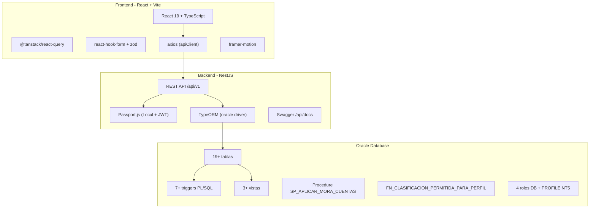
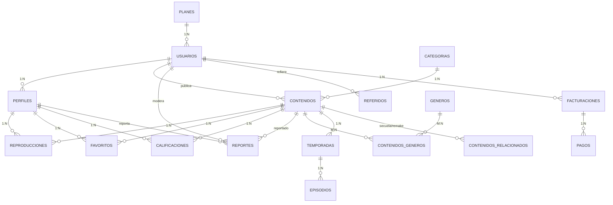
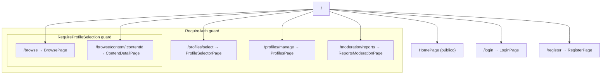

# Análisis Completo del Proyecto MinFlix

> **Proyecto académico** — Bases de Datos II, Noveno Semestre
> **Autores:** Juan Sebastián Noreña Espinosa, Daniel Eduardo Jurado Celemín, Samuel Andrés Castaño
> **Stack:** Oracle Database + NestJS (TypeScript) + React/Vite (TypeScript)

---

## 1. Visión General del Dominio

MinFlix es una **plataforma de streaming multimedia** con las siguientes capacidades funcionales:

| Área | Descripción |
|------|-------------|
| **Catálogo** | Películas, series, documentales, música y podcasts con categorización |
| **Cuentas y Perfiles** | Multi-perfil por cuenta principal con restricciones por plan |
| **Reproducción** | Tracking de consumo con continuidad ("Seguir viendo") |
| **Comunidad** | Favoritos, calificaciones con regla de 50%, y reportes de contenido |
| **Finanzas** | Facturación mensual, referidos, descuentos por fidelidad y mora automática |
| **Analítica** | Reportes ejecutivos con consultas OLAP (planificado) |

---

## 2. Arquitectura de Tres Capas



### 2.1 Datos de Conexión

| Variable | Default |
|----------|---------|
| `DB_CONNECT_STRING` | `localhost:1521/FREEPDB1` |
| `DB_USER` | `MINFLIX_APP` |
| `DB_SCHEMA` | configurable |
| `JWT_SECRET` | `dev_jwt_secret` |
| `CORS_ORIGIN` | `http://localhost:5173` |
| `VITE_API_URL` | `http://localhost:3000/api/v1` |

---

## 3. Capa de Base de Datos (Oracle)

### 3.1 Scripts Versionados (14 scripts en orden)

| # | Archivo | Propósito | Objetos Principales |
|---|---------|-----------|---------------------|
| 00 | `00_drop_all.sql` | Limpieza total | DROP de todos los objetos |
| 01 | `01_bootstrap_oracle_iteracion1.sql` | Auth base | `PLANES`, `USUARIOS`, `PERFILES` |
| 02 | `02_catalogo_base_iteracion2.sql` | Catálogo | `CATEGORIAS`, `CONTENIDOS` + 5 categorías seed + 5 contenidos seed |
| 03 | `03_reglas_perfiles_iteracion1.sql` | Reglas de negocio | `TRG_PERFILES_LIMITE_PLAN_BI`, `FN_CLASIFICACION_PERMITIDA_PARA_PERFIL`, `VW_CONTENIDO_VISIBLE_POR_PERFIL` |
| 04 | `04_reproducciones_iteracion2.sql` | Tracking | `REPRODUCCIONES`, `TRG_REPRODUCCIONES_REGLAS_BIU`, `VW_CONTINUAR_VIENDO` |
| 05 | `05_comunidad_favoritos_iteracion3.sql` | Favoritos | `FAVORITOS` + trigger de validación |
| 06 | `06_comunidad_calificaciones_iteracion3.sql` | Calificaciones | `CALIFICACIONES` + trigger regla 50% |
| 07 | `07_catalogo_extendido_iteracion4.sql` | Catálogo avanzado | `GENEROS`, `CONTENIDOS_GENEROS`, `TEMPORADAS`, `EPISODIOS`, `CONTENIDOS_RELACIONADOS` |
| 08 | `08_comunidad_reportes_moderacion_iteracion4.sql` | Moderación | `REPORTES` + triggers de moderación + `VW_REPORTES_PENDIENTES_SOPORTE` |
| 09 | `09_finanzas_referidos_iteracion5.sql` | Finanzas | `REFERIDOS`, `FACTURACIONES`, `PAGOS` + triggers financieros + `SP_APLICAR_MORA_CUENTAS` |
| 10 | `10_organizacion_equipo_iteracion5.sql` | Organización | `DEPARTAMENTOS`, `EMPLEADOS` (jerarquía supervisor) |
| 11 | `11_seguridad_roles_nt5.sql` | Seguridad NT5 | `PRF_MINFLIX_OPERACION`, 4 roles, 4 usuarios DB, GRANTs por rol |
| 12 | `12_diccionario_comentarios_modelo_fisico.sql` | Documentación | COMMENTs en todas las tablas y columnas |
| 13 | `13_seed_usuarios_roles_login_iteracion5.sql` | Seed auth | Usuarios por rol con bcrypt hash |
| 14 | `14_seed_datos_funcionales_iteracion5.sql` | Seed funcional | Datos masivos de catálogo, reproducciones, favoritos, etc. |

### 3.2 Modelo de Tablas Principales



### 3.3 Triggers y Reglas de Negocio en Oracle

| Trigger | Tabla | Errores ORA | Regla |
|---------|-------|-------------|-------|
| `TRG_PERFILES_LIMITE_PLAN_BI` | PERFILES | ORA-20011, ORA-20012 | Máximo de perfiles según plan |
| `TRG_REPRODUCCIONES_REGLAS_BIU` | REPRODUCCIONES | ORA-20021..ORA-20024 | Cuenta activa + clasificación + progreso ≤ duración + cálculo automático de % |
| `TRG_FACTURACIONES_CALCULO_BIU` | FACTURACIONES | ORA-20081, ORA-20082 | Validación fechas + cálculo monto_final con descuentos |
| `TRG_PAGOS_ACTUALIZA_FACTURA_AI` | PAGOS | — | Pago exitoso → factura PAGADA + cuenta ACTIVA |
| Triggers comunidad (05-08) | FAVORITOS, CALIFICACIONES, REPORTES | ORA-20031..ORA-20066 | Clasificación infantil, regla 50%, moderación por rol |

### 3.4 Seguridad NT5 (Núcleo 5)

| Rol Oracle | Permisos |
|------------|----------|
| `ROL_ADMIN` | Full CRUD en todas las tablas + EXECUTE en funciones/procedures |
| `ROL_ANALISTA` | Solo SELECT sobre todas las tablas (lectura analítica) |
| `ROL_SOPORTE` | SELECT contexto + INSERT/UPDATE en REPORTES |
| `ROL_CONTENIDO` | Mantenimiento editorial de catálogo (sin finanzas ni moderación) |

**PROFILE:** `PRF_MINFLIX_OPERACION` — 3 sesiones máx, 30 min idle, 5 intentos fallidos, contraseña caduca 180 días.

---

## 4. Capa Backend (NestJS)

### 4.1 Estructura de Módulos

```
minflix-backend/src/
├── main.ts                    # Bootstrap: Helmet, Compression, CORS, Swagger, ValidationPipe
├── app.module.ts              # Root: ConfigModule, TypeORM, 4 feature modules
├── config/
│   └── database.config.ts     # TypeORM async config para Oracle
├── auth/                      # Módulo de autenticación (~4 DTOs, 3 entidades, 2 guards, 2 strategies)
├── catalog/                   # Módulo de catálogo (~4 DTOs, 2 entidades, 1 contract)
├── playback/                  # Módulo de reproducción (~4 DTOs, 2 entidades, 1 contract)
└── community/                 # Módulo de comunidad (~12 DTOs, 3 entidades, 1 contract)
```

### 4.2 Módulo Auth — [auth.module.ts](file:///c:/Universidad/Noveno%20Semestre/Bases_II/MinFlix/minflix-backend/src/auth/auth.module.ts)

**Entidades TypeORM:**
| Entidad | Tabla Oracle | Campos principales |
|---------|-------------|-------------------|
| [UserEntity](file:///c:/Universidad/Noveno%20Semestre/Bases_II/MinFlix/minflix-backend/src/auth/entities/user.entity.ts) | `USUARIOS` | id, nombre, email, passwordHash, rol, estadoCuenta, plan (ManyToOne), perfiles (OneToMany) |
| [PlanEntity](file:///c:/Universidad/Noveno%20Semestre/Bases_II/MinFlix/minflix-backend/src/auth/entities/plan.entity.ts) | `PLANES` | id, nombre, precioMensual, limitePerfiles |
| [ProfileEntity](file:///c:/Universidad/Noveno%20Semestre/Bases_II/MinFlix/minflix-backend/src/auth/entities/profile.entity.ts) | `PERFILES` | id, nombre, avatar, tipoPerfil, usuario (ManyToOne) |

**Estrategias Passport:**
- [LocalStrategy](file:///c:/Universidad/Noveno%20Semestre/Bases_II/MinFlix/minflix-backend/src/auth/strategies/local.strategy.ts): Valida email + password contra Oracle con bcrypt
- [JwtStrategy](file:///c:/Universidad/Noveno%20Semestre/Bases_II/MinFlix/minflix-backend/src/auth/strategies/jwt.strategy.ts): Extrae token Bearer y normaliza payload `{userId, email, role}`

**Endpoints Auth** — [auth.controller.ts](file:///c:/Universidad/Noveno%20Semestre/Bases_II/MinFlix/minflix-backend/src/auth/auth.controller.ts):

| Método | Ruta | Guard | Descripción |
|--------|------|-------|-------------|
| POST | `/auth/login` | LocalAuth | Login con Passport local → JWT |
| POST | `/auth/register` | — | Registro con plan + perfil inicial |
| GET | `/auth/profile` | JwtAuth | Identidad autenticada |
| GET | `/auth/profiles` | JwtAuth | Listar perfiles de la cuenta |
| POST | `/auth/profiles` | JwtAuth | Crear perfil (valida límite plan) |
| POST | `/auth/profiles/avatar` | JwtAuth | Upload avatar multipart (max 5MB) |
| PATCH | `/auth/profiles/:id` | JwtAuth | Actualizar perfil |
| DELETE | `/auth/profiles/:id` | JwtAuth | Eliminar perfil (mín 1 activo) |

**Servicio Auth** — [auth.service.ts](file:///c:/Universidad/Noveno%20Semestre/Bases_II/MinFlix/minflix-backend/src/auth/auth.service.ts) (470 líneas):
- Implementa `OnModuleInit` para seed de admin configurable por env
- Validación de credenciales con búsqueda case-insensitive (`UPPER()`)
- Creación de perfil con doble validación: app-level + catch de `ORA-20011`
- Resolución de URL pública de avatars con fallback a host del request

### 4.3 Módulo Catalog — [catalog.module.ts](file:///c:/Universidad/Noveno%20Semestre/Bases_II/MinFlix/minflix-backend/src/catalog/catalog.module.ts)

**Entidades:**
| Entidad | Tabla | Relaciones |
|---------|-------|------------|
| [ContentEntity](file:///c:/Universidad/Noveno%20Semestre/Bases_II/MinFlix/minflix-backend/src/catalog/entities/content.entity.ts) | `CONTENIDOS` | ManyToOne → Categoría, ManyToOne → empleadoPublicador |
| [CategoryEntity](file:///c:/Universidad/Noveno%20Semestre/Bases_II/MinFlix/minflix-backend/src/catalog/entities/category.entity.ts) | `CATEGORIAS` | OneToMany → Contenidos |

**Endpoints Catalog** — [catalog.controller.ts](file:///c:/Universidad/Noveno%20Semestre/Bases_II/MinFlix/minflix-backend/src/catalog/catalog.controller.ts):

| Método | Ruta | Guard | Autorización |
|--------|------|-------|-------------|
| GET | `/catalog/categories` | — | Público |
| POST | `/catalog/categories` | JwtAuth | Solo admin/contenido |
| GET | `/catalog/contents` | — | Público (filtros: tipo, categoría, clasificación, exclusivo) |
| GET | `/catalog/contents/:id` | — | Público |
| POST | `/catalog/contents` | JwtAuth | Solo admin/contenido |
| PATCH | `/catalog/contents/:id` | JwtAuth | Solo admin/contenido |

> [!NOTE]
> El controller usa `assertCatalogEditorRole()` como guard manual inline en vez de un guard decorator dedicado.

### 4.4 Módulo Playback — [playback.module.ts](file:///c:/Universidad/Noveno%20Semestre/Bases_II/MinFlix/minflix-backend/src/playback/playback.module.ts)

**Entidades:**
| Entidad | Tabla/Vista | Campos clave |
|---------|------------|--------------|
| `PlaybackEntity` | `REPRODUCCIONES` | perfil, contenido, progresoSegundos, duracionTotal, porcentajeAvance, estadoReproduccion |
| `ContinueWatchingEntity` | `VW_CONTINUAR_VIENDO` | Vista Oracle read-only con ROW_NUMBER sobre reproducciones no finalizadas |

**Endpoints Playback** — todos protegidos con `JwtAuthGuard`:

| Método | Ruta | Descripción |
|--------|------|-------------|
| POST | `/playback/start` | Iniciar reproducción (progreso = 0) |
| POST | `/playback/progress` | Reportar avance/pausa/fin |
| GET | `/playback/continue-watching` | Fila "Seguir viendo" por perfil |
| GET | `/playback/history` | Historial completo por perfil |

**Validaciones integradas:**
- Ownership de perfil contra cuenta autenticada (`ensureProfileOwnership`)
- Catch de ORA-20021 a ORA-20024 con mapeo a excepciones HTTP

### 4.5 Módulo Community — [community.module.ts](file:///c:/Universidad/Noveno%20Semestre/Bases_II/MinFlix/minflix-backend/src/community/community.module.ts)

**El módulo más complejo** — 826 líneas de servicio, 12 DTOs, 3 entidades.

**Entidades:**
| Entidad | Tabla |
|---------|-------|
| `FavoriteEntity` | `FAVORITOS` |
| `RatingEntity` | `CALIFICACIONES` |
| [ReportEntity](file:///c:/Universidad/Noveno%20Semestre/Bases_II/MinFlix/minflix-backend/src/community/entities/report.entity.ts) | `REPORTES` — con relaciones a perfilReportador, contenido, usuarioModerador |

**Endpoints Community** — todos protegidos con JWT:

| Grupo | Método | Ruta | Descripción |
|-------|--------|------|-------------|
| Favoritos | POST | `/community/favorites` | Agregar a favoritos (idempotente) |
| | DELETE | `/community/favorites/:contenidoId` | Quitar de favoritos |
| | GET | `/community/favorites` | Listar favoritos por perfil |
| | GET | `/community/favorites/status` | Estado de favorito (booleano) |
| Calificaciones | POST | `/community/ratings` | Crear/actualizar calificación (upsert) |
| | DELETE | `/community/ratings/:contenidoId` | Eliminar calificación |
| | GET | `/community/ratings` | Listar calificaciones por perfil |
| | GET | `/community/ratings/status` | Estado con puntaje y reseña |
| Reportes | POST | `/community/reports` | Reportar contenido |
| | GET | `/community/reports` | Mis reportes por perfil |
| | GET | `/community/reports/moderation` | Bandeja de moderación (soporte/admin) |
| | PATCH | `/community/reports/:id/moderation` | Moderar: cambiar estado + resolución |

**Reglas de negocio notables:**
- Favoritos: restricción de clasificación para perfiles infantiles (`+16`, `+18` bloqueados)
- Calificaciones: Oracle trigger valida reproducción >50% antes de permitir calificación (ORA-20041)
- Reportes: flujo de estados `ABIERTO → EN_REVISION → RESUELTO/DESCARTADO`
- Moderación: doble validación de rol (JWT + base de datos)

### 4.6 Contratos de API (View Types)

Cada módulo define interfaces de contrato en `contracts/`:
- `CatalogCategoryView`, `CatalogContentView`
- `PlaybackEventView`, `ContinueWatchingView`, `PlaybackHistoryItemView`
- `FavoriteItemView`, `FavoriteStatusView`, `RatingItemView`, `RatingStatusView`, `ReportItemView`

Los servicios usan métodos `private map*()` para normalizar entidades a contratos.

### 4.7 Calidad y Configuración Backend

| Aspecto | Implementación |
|---------|---------------|
| **Validación** | `ValidationPipe` global con whitelist + transform + forbidUnknownValues |
| **Seguridad HTTP** | Helmet (con cross-origin resource policy) + Compression |
| **CORS** | Origen configurable con credentials |
| **Logging** | nestjs-pino + pino-pretty |
| **Lint** | ESLint + eslint-plugin-tsdoc + Prettier |
| **Testing** | Jest + Supertest (3 archivos .spec.ts presentes) |
| **Git Hooks** | Husky + lint-staged |
| **Documentación** | TypeDoc + TSDoc en español obligatorio |
| **API Docs** | Swagger en `/api/docs` con Bearer Auth |

---

## 5. Capa Frontend (React + Vite)

### 5.1 Estructura General

```
minflix-frontend/src/
├── main.tsx                # Entry: StrictMode + QueryClient + BrowserRouter + App
├── App.tsx                 # AppRouter + Toaster (react-hot-toast)
├── index.css              # Sistema de diseño completo (30KB, paleta cinematica)
├── App.css                # Estilos complementarios
├── router/
│   ├── AppRouter.tsx       # Rutas con guards anidados
│   ├── RequireAuth.tsx     # Guard: exige JWT en localStorage
│   └── RequireProfileSelection.tsx  # Guard: exige perfil activo
├── pages/
│   ├── HomePage.tsx        # Landing pública
│   ├── LoginPage.tsx       # Formulario login (react-hook-form + zod)
│   ├── RegisterPage.tsx    # Formulario registro con selección de plan
│   ├── ProfileSelectorPage.tsx  # "¿Quién está viendo?" estilo Netflix
│   ├── ProfilesPage.tsx    # CRUD de perfiles con upload de avatar
│   ├── BrowsePage.tsx      # Catálogo principal (~950 líneas)
│   ├── ContentDetailPage.tsx  # Detalle con favoritos, rating, reportes (~1005 líneas)
│   └── ReportsModerationPage.tsx  # Bandeja de moderación para soporte/admin
└── shared/
    ├── api/client.ts       # Axios con interceptor JWT automático
    ├── session/
    │   ├── authSession.ts  # Decodifica JWT del localStorage para extraer userId/email/role
    │   └── profileSession.ts  # Perfil activo en localStorage (get/save/clear)
    ├── helpers/
    │   ├── authFieldHelp.ts   # Textos de ayuda para campos ambiguos
    │   ├── avatarUrl.ts       # Resolución de URL de avatar + iniciales fallback
    │   └── plansCatalog.ts    # Catálogo estático de planes con beneficios
    └── ui/
        ├── AuthSplitLayout.tsx  # Layout split (hero + formulario) para login/registro
        ├── PasswordInput.tsx    # Input con toggle ver/ocultar contraseña
        └── buttonStyles.ts     # Clases CSS reutilizables para botones
```

### 5.2 Árbol de Rutas



### 5.3 Gestión de Estado

| Tipo | Mecanismo | Almacenamiento |
|------|-----------|----------------|
| **Autenticación** | JWT decodificado client-side (`authSession.ts`) | `localStorage["minflix_access_token"]` |
| **Perfil Activo** | JSON serializado (`profileSession.ts`) | `localStorage["minflix_active_profile"]` |
| **Server State** | `@tanstack/react-query` (QueryClient en main.tsx) | En memoria |
| **Formularios** | `react-hook-form` + `zod` resolver | Estado local de componente |
| **Notificaciones** | `react-hot-toast` (Toaster en App.tsx) | Efímero |

### 5.4 Páginas Detalladas

#### LoginPage / RegisterPage
- Formularios validados con Zod schema
- Login: `{email, password}` → `POST /auth/login` → guarda JWT → navega a `/profiles/select`
- Registro: `{nombre, email, password, planNombre, nombrePerfilInicial}` → `POST /auth/register`
- Ambas usan `AuthSplitLayout` con mensajes cinematicos y `PasswordInput` con toggle

#### ProfileSelectorPage
- Estilo "¿Quién está viendo?" tipo Netflix
- Carga perfiles con `GET /auth/profiles`
- Al seleccionar: `saveActiveProfile()` → navega a `/browse`
- Animaciones con `framer-motion`

#### ProfilesPage
- **CRUD completo** de perfiles: crear, editar (inline), eliminar
- Upload de avatar: `<input type="file">` → `POST /auth/profiles/avatar` (multipart) → URL en formulario
- Vista previa de avatar cargado
- Resumen visual: total, adultos, infantiles

#### BrowsePage (~950 líneas)
La vista principal más compleja del frontend:
- **Hero panel**: contenido destacado (primer item del catálogo)
- **Continua viendo**: fila horizontal con barra de progreso visual
- **Mi lista (Favoritos)**: fila horizontal de contenidos guardados
- **Actividad reciente**: grid de historial de reproducción
- **Catálogo por categoría**: agrupado y filtrable por tipo, categoría y clasificación
- **Navbar responsive**: hamburger menu con perfil activo, avatar, y acciones
- Todas las tarjetas son clicables → navegan a `ContentDetailPage`

#### ContentDetailPage (~1005 líneas)
Vista de detalle con 6 secciones funcionales:
1. **Hero de detalle**: título, sinopsis, badges, botones de acción
2. **Reproducir ahora**: `POST /playback/start`
3. **Favoritos**: toggle agregar/quitar con estado consultado al montar
4. **Calificación**: 5 estrellas interactivas + textarea de reseña + upsert/delete
5. **Reportar contenido**: selector de motivo + detalle opcional + historial de reportes previos
6. **Contenido relacionado**: misma categoría, filtrado para excluir el actual

#### ReportsModerationPage
- Vista exclusiva para roles `admin` y `soporte`
- Bandeja de reportes filtrable por estado
- Acción de moderación: cambiar estado + escribir resolución

### 5.5 API Client

[client.ts](file:///c:/Universidad/Noveno%20Semestre/Bases_II/MinFlix/minflix-frontend/src/shared/api/client.ts) configura axios con:
- `baseURL`: `VITE_API_URL` o `http://localhost:3000/api/v1`
- Timeout de 10s
- Interceptor de request que inyecta `Authorization: Bearer <token>` automáticamente

### 5.6 Diseño Visual

- **Paleta**: cinematica con acentos rojos (#e50914) y dorados sobre fondo oscuro
- **Tipografía**: Helvetica Neue / Helvetica / Arial
- **Clases CSS** con prefijo `nf-` (Netflix-inspired): `nf-shell`, `nf-browse-*`, `nf-content-tile`, etc.
- **Animaciones**: framer-motion con entrada escalonada (opacity + y-offset)
- **Responsive**: hamburger menu con media queries

---

## 6. Documentación del Proyecto

### 6.1 Archivos en `Docs/`

| Archivo | Contenido |
|---------|-----------|
| [Enunciado.md](file:///c:/Universidad/Noveno%20Semestre/Bases_II/MinFlix/Docs/Enunciado.md) | Requerimientos académicos completos (14.6KB) |
| [Epicas.md](file:///c:/Universidad/Noveno%20Semestre/Bases_II/MinFlix/Docs/Epicas.md) | 6 épicas INVEST con trazabilidad a roles y cobertura del enunciado |
| [Plan_Desarrollo.md](file:///c:/Universidad/Noveno%20Semestre/Bases_II/MinFlix/Docs/Plan_Desarrollo.md) | Plan detallado de iteraciones (28.8KB) |
| [Guia_Diseno_UI.md](file:///c:/Universidad/Noveno%20Semestre/Bases_II/MinFlix/Docs/Guia_Diseno_UI.md) | Paleta, tipografía y convenciones de diseño |
| [Credenciales_Seed_Login.md](file:///c:/Universidad/Noveno%20Semestre/Bases_II/MinFlix/Docs/Credenciales_Seed_Login.md) | Usuarios de prueba con contraseñas para cada rol |
| [Seed_Extra_Datos_Funcionales.md](file:///c:/Universidad/Noveno%20Semestre/Bases_II/MinFlix/Docs/Seed_Extra_Datos_Funcionales.md) | Documentación del dataset funcional de pruebas |

### 6.2 Épicas INVEST

| # | Épica | Estado Backend | Estado Frontend | Estado Oracle |
|---|-------|----------------|-----------------|---------------|
| 1 | Catálogo multiformato | ✅ Módulo `catalog` operativo | ✅ BrowsePage + filtros | ✅ Tablas + seed. Catálogo extendido (07) parcial |
| 2 | Cuentas, planes y perfiles | ✅ AuthModule completo | ✅ Login, Register, Profiles CRUD | ✅ Triggers de límite |
| 3 | Motor de reproducción | ✅ PlaybackModule completo | ✅ Continuar viendo + historial | ✅ Vista VW_CONTINUAR_VIENDO |
| 4 | Comunidad (fav, ratings, reportes) | ✅ CommunityModule completo | ✅ Detalle + moderación | ✅ Triggers de regla 50% + moderación |
| 5 | Finanzas | ❌ Sin módulo backend | ❌ Sin vistas | ✅ Tablas + triggers + SP |
| 6 | Analítica | ❌ Sin módulo backend | ❌ Sin dashboards | ❌ Sin vistas materializadas |

---

## 7. Análisis de Tests

| Archivo | Módulo | Líneas |
|---------|--------|--------|
| [auth.service.spec.ts](file:///c:/Universidad/Noveno%20Semestre/Bases_II/MinFlix/minflix-backend/src/auth/auth.service.spec.ts) | Auth | ~4.9KB |
| [playback.service.spec.ts](file:///c:/Universidad/Noveno%20Semestre/Bases_II/MinFlix/minflix-backend/src/playback/playback.service.spec.ts) | Playback | ~8.8KB |
| [community.service.spec.ts](file:///c:/Universidad/Noveno%20Semestre/Bases_II/MinFlix/minflix-backend/src/community/community.service.spec.ts) | Community | ~15.8KB |
| [app.controller.spec.ts](file:///c:/Universidad/Noveno%20Semestre/Bases_II/MinFlix/minflix-backend/src/app.controller.spec.ts) | Root | ~0.7KB |

> [!NOTE]
> Solo existen tests unitarios para los servicios del backend con mocks de repositorios. No hay tests e2e funcionales ni tests de frontend (vitest configurado pero sin archivos de test).

---

## 8. Hallazgos y Observaciones

### 8.1 Dependencias Fuera de Lugar

> [!WARNING]
> El `package.json` del backend incluye dependencias que pertenecen al frontend:
> - `lucide-react` (línea 44)
> - `react-hot-toast` (línea 52)
>
> Estas no causan errores en runtime pero ensucian el árbol de dependencias del backend.

### 8.2 Patrón de Manejo de Errores Oracle

El backend implementa un **patrón consistente** de catch de errores Oracle con código específico:
```typescript
if (this.isOracleBusinessRuleError(error, 'ORA-20011')) {
  throw new BadRequestException('...');
}
```
Este patrón se repite en `AuthService`, `PlaybackService` y `CommunityService` — podría ser candidato a **refactorización** en un helper compartido o interceptor.

### 8.3 Brechas Funcionales Identificadas

| Brecha | Detalle |
|--------|---------|
| **Épica 5 - Finanzas** | Las tablas Oracle existen pero **no hay módulo NestJS** ni vistas frontend |
| **Épica 6 - Analítica** | Sin implementación en ninguna capa. Los scripts OLAP y vistas materializadas están pendientes |
| **Catálogo extendido** | Tablas `GENEROS`, `TEMPORADAS`, `EPISODIOS`, `CONTENIDOS_RELACIONADOS` en Oracle pero **sin mapeo TypeORM** ni endpoints |
| **Organización** | Tablas `DEPARTAMENTOS`, `EMPLEADOS` en Oracle sin representación en backend/frontend |
| **Tests frontend** | Vitest configurado pero sin archivos de test |
| **Refresh token** | Comentario en LoginPage: "En la siguiente iteración se moverá a un store seguro con refresh token" |

### 8.4 Fortalezas

| Aspecto | Evaluación |
|---------|-----------|
| **Documentación TSDoc** | ✅ Excelente: todos los servicios, controladores y entidades documentados en español |
| **Contratos de API** | ✅ Tipos de vista bien definidos como interfaz entre entidades y respuestas |
| **Validación doble** | ✅ App-level (NestJS pipes + service) + DB-level (Oracle triggers) |
| **Seguridad** | ✅ bcrypt, JWT, Helmet, CORS, ValidationPipe, roles por endpoint |
| **UX del frontend** | ✅ Flujo Netflix-like completo: login → perfil → browse → detalle |
| **Consistencia de SQL** | ✅ Scripts versionados y ordenados con dependencias claras |
| **Swagger** | ✅ Todos los endpoints documentados con ApiOperation y ApiBearerAuth |
| **Git hooks** | ✅ Husky + lint-staged para calidad pre-commit |

---

## 9. Mapa de Archivos con Líneas de Código

| Capa | Archivos | ~LOC totales |
|------|----------|-------------|
| Database scripts (14) | `.sql` | ~3,500+ |
| Backend services (4) | `.service.ts` | ~1,960 |
| Backend controllers (4) | `.controller.ts` | ~730 |
| Backend entities (11) | `.entity.ts` | ~700 |
| Backend DTOs (24) | `.dto.ts` | ~850 |
| Backend specs (4) | `.spec.ts` | ~1,200 |
| Frontend pages (8) | `.tsx` | ~3,800 |
| Frontend shared (8) | `.ts/.tsx` | ~450 |
| CSS | `index.css` + `App.css` | ~1,150 |
| **Total estimado** | | **~14,300+** |
